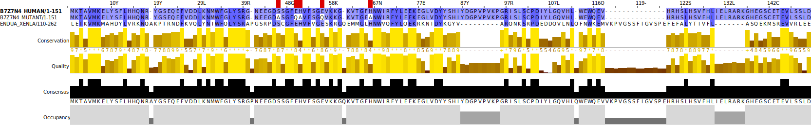

================
Mutated Sequence
================

The following mutations were chosen due to their biological
significance in the homolog protein found in Xenopus laevis. The
following sites have been shown to be essential for catalytic
activity, specifically RNA cleavage [GIOIA2005]_.

.. list-table:: Mutations

   * - B7Z7N4 Position
     - Wild Type Residue
     - Mutant Residue
     - Homolog Residue
   * - 46
     - Ser
     - Ala
     - Ser
   * - 50
     - Glu
     - Gln
     - Glu
   * - 51
     - His
     - Ala
     - His
   * - 56
     - Glu
     - Gln
     - Glu
   * - 66
     - His
     - Ala
     - His

    Sequence alignment and highlighted point mutation positions.

Structure Comparison
====================

..  raw:: html

    <iframe
      id="mutant-jsmol-frame"
      data-external="1"
      src="_static/models/mutant/mutant.html"
      height="600"
      width="100%"
      style="border: 0"
      ></iframe>

Methods
=======

Missense3D

 1. Position on 3D structure

 2. Uploaded swiss-model.pdb

 4. Point mutations:

    - > 46 ser -> ala
    - > 50 glu -> gln
    - > 51 his -> ala
    - > 56 glu -> gln
    - > 66 his -> ala

Notes
=====

Hydrogen bond from PDB residue 46

Wild type
---------

Donor 	Acceptor 	Distance (Å) 	Type
A0046-SER OG 	A0037-TYR O 	3.52 	SM
A0046-SER OG 	A0051-HIS NE2 	2.84 	SS
A0051-HIS NE2 	A0046-SER OG 	2.84 	SS

Mutant
------

Donor 	Acceptor 	Distance (Å) 	Type

No hydrogen bond found

M: main chain, S: side chain
