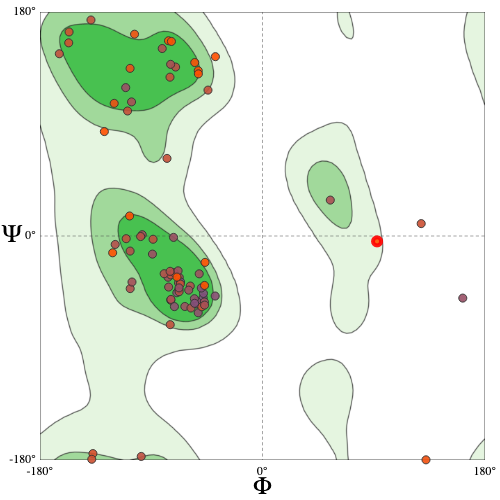
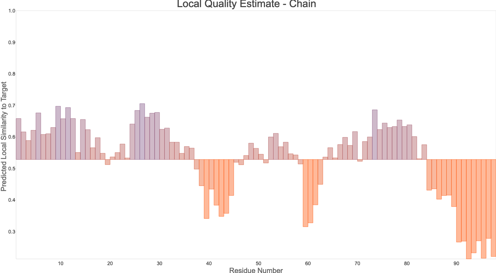
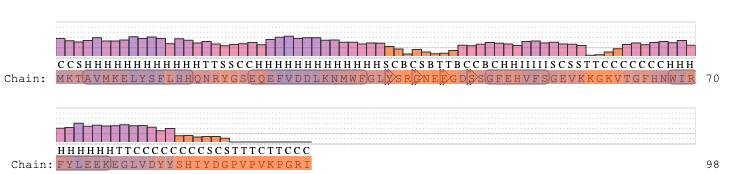

=============================
Fold Recognition using Phyre2
=============================

Results
=======

Predicted Structure
-------------------

..  raw:: html

    <iframe
      id="phyre-jsmol-frame"
      data-external="1"
      src="_static/models/phyre/phyre.html"
      height="600"
      width="100%"
      style="border: 0"
      ></iframe>

Model Quality
-------------

Methods
=======

TODO
