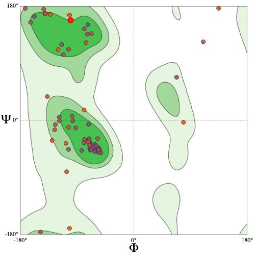
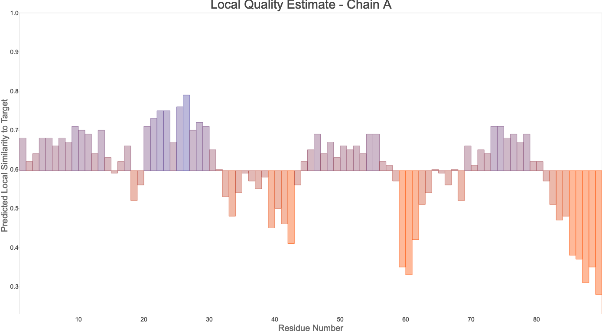
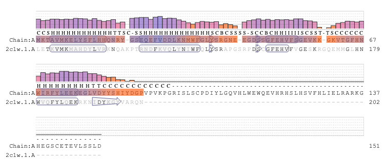

===================================
Homology Modeling using Swiss-Model
===================================

Predicted Structure
===================

..  raw:: html

    <iframe
      id="swiss-model-jsmol-frame"
      data-external="1"
      src="_static/models/swiss-model/swiss-model.html"
      height="600"
      width="100%"
      style="border: 0"
      ></iframe>

Model Quality
=============

Swiss-Model's model assessment tool was used to assess the quality of
the model.

The Ramachandran plot shows most residues in alpha-helices with many
others in beta-sheet structures. There are a few outlying residues
which are outside typical angles for secondary structures.

The predicted local quality estimates show roughly half of residues
with a QMEANDisCo local score above 0.6, reaching as high as 0.8. This
also shows some regions with deep valleys, with scores reaching as low
as 0.3. These regions lack well defined structures in the model and
appear as loops and coils, which is similar to the known structure of
the homolog.

The following image shows per residue QMEAN quality estimates related
to the pairwise sequence alignment and secondary structure
information. The secondary structures match very close, except at the
end where a beta sheet was not predicted in a region where the homolog
is known to have such structure.

Methods
=======

Using Swiss-Model, I started a new modeling project, providing the
B7Z7N4 identifier and clicked "Search for Templates". This yielded a
number of candidate homologs to be used, including identity, coverage,
GMQE, and QMEANDisCo values to estimate likely model quality. I
selected the 6 templates corresponding to the 2C1W structure from PDB
as it seemed the best match, and clicked build models. I then selected
one of the models with good GMQE and QMEANDisCo global scores, and
then clicked on the assessment tool to view the predicted structure
and evaluate the model quality.
